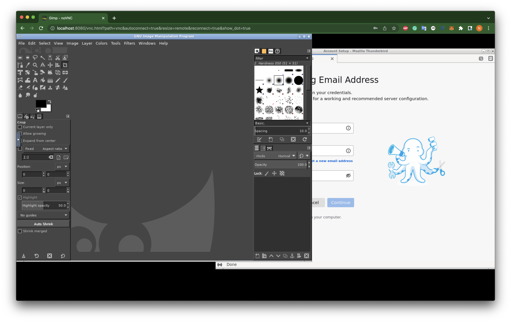

# Dockerize-Application: A docker Image template to Dockerize any application


<p float="middle">
  
</p>


This repository contains a Docker image of an Ubuntu container running Thunderbird and Gimp. It's meant as a template to show the process of Dockerize any application. Go to <q>How to Dockerize a different application</q> section to see how you can Dockerize another application.

## Installation

### How to build and run the application container

I decided to call the image vnc-docker, this is an arbitrary choice. Build the container by running:

```docker build -t vnc-app .```

Create the network:

```docker network create vnc-net```

Create the volume for storing data:

```docker volume create vnc-data```

Run the container in detached mode:

```docker run --detach --restart=always --volume=vnc-data:/data --net=vnc-net --name=vnc-app vnc-app```

Good! You can replace ```--name=vnc-app``` with any name you want. 

### Setting up and building a Caddy container

We will use [Caddy](https://caddyserver.com/) to connect to the Docker container. All the configurations files are inside the ```caddy``` folder.

In short, the Caddyfile proxies the root directory to the vnc-app container you just created. Here's what you need to do:

1. Build up the Caddy container run:
   
    ```cd caddy && docker build -t vnc-caddy .```

2. Generate an hash for login. This command will output an hash. Copy this to your clipboard in preparation of running the next command:
   
    ```docker run --rm -it vnc-caddy caddy hash-password -plaintext 'mypass'```

3. Copy/paste the hash and run the container in detached mode:
   
    ```docker run --detach --restart=always --volume=vnc-data:/data --net=vnc-net --name=vnc-web --env=APP_USERNAME="myuser" --env=APP_PASSWORD_HASH="mypass-hash" --publish=8080:8080 vnc-caddy```

## How to connect

Open a new broswer tab and tap ```http://your_server_ip:8080```. You should see a login page. Login with the user and password used when building the Caddy container.

You can also access files by opening ```http://your_server_ip:8080/files```

## How to Dockerize a different application

If you want to containerize a different application, follow these steps:

1. Add another element ```<execute>/usr/bin/<application></execute>```inside menu.xml
2. Change the label of the item in ```[program:<application>]``` inside supervisord.conf, as explained in the [Supervisor Documentation](http://supervisord.org/running.html#adding-a-program)
3. install the application inside Dockerfile (see comment)